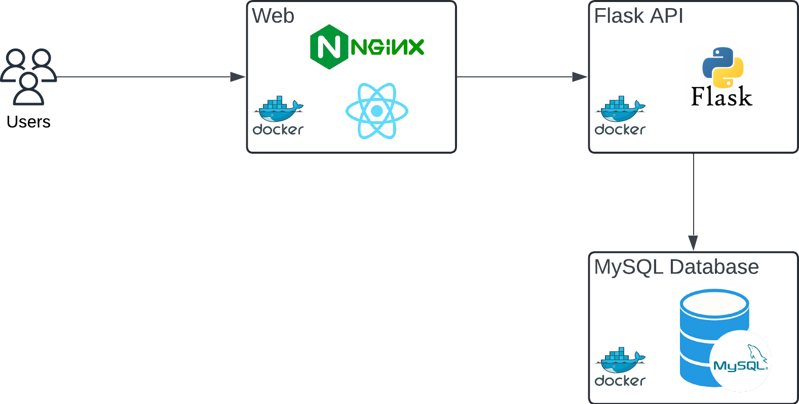

# Splitwise
An expense tracking system as a project for CS-157A (Introduction to Database Systems)

## Top Level Design
<div align="center">
  
</div>


## Tech Stack
**Frontend:**
- React.js
- React Router
- Tailwind CSS

**Backend:**
- Python Flask
- Flask-CORS

**Database:**
- MySQL (Version 9.3.0)

## Installation

### Prerequisites
- Docker: Version `20.10` or higher.
- Docker Compose: Version `1.29` or higher.
- Git: For cloning the repository.
- Ports `3000` (frontend), `5001` (backend) and `3306` (database) must be available.

### Directory Structure
````
splitwise/
├── backend/
│   ├── main.py               # Flask application
│   ├── requirements.txt      # Python dependencies
│   ├── scripts               # Scripts for initialization
│   │   ├── init.sql          # Database initialization script  
├── frontend/
│   ├── public/
│   ├── src/
│   │   ├── components/       # React components
│   │   ├── pages/            # Page components
│   │   ├── App.js            # Main application
│   ├── package.json          # Frontend dependencies
````

### How to run the application
1. Clone the repo:
   ```bash
   git clone https://github.com/syedalijabir/splitwise.git
   cd splitwise/
   ```

2. Build and Run with Docker Compose
   ```bash
    docker-compose up --build
   ```
   - Frontend: `http://localhost:3000`
   - Backend API: `http://localhost:5001`
   - Database: `localhost:3306` (exposed for debugging).
   

4. Stop the application
   ```bash
   docker-compose down
   ```
   - To remove volumes: `docker-compose down -v`

